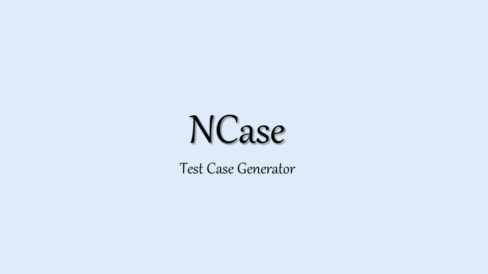

Status:

[](https://ci.appveyor.com/project/jeromerg/ncase/branch/master)  [](https://www.nuget.org/packages/NCase/)

NCase
=====

Define, Combine, Visualize and Replay hundreds of test cases with a few lines of code.

NCase is a mix between a Mocking Framework like [Moq][Moq] and a parametrized test framework, having advanced combinatorial capabilities. 

Features at Glance
------------------




Installation
------------

In the Nuget Package Manager Console:

In combination with NUnit:

```
Install-Package NCase, NCase.NunitAdapter
```

In combination with XUnit:

```
Install-Package NCase, NCase.XunitAdapter
```

Introduction
------------

Read the [long introduction](./Introduction.md).

Next Steps
==========

First, have fun with NCase! 

Then, please provide feedbacks, critiques, and suggestions! 

Finally, be aware that NCase is under continuous development. Some upcoming features are:

- Full mocking functionalities 
	- mocking of classes
	- mocking of methods
	- "[moq][moq] like" `Setup(...)` and `Verify(...)`
- Autonomous parametrized test framework (including Assert compatible with NCase record/replay mechanism, CLI, Visual Studio and Resharper adapter) 
