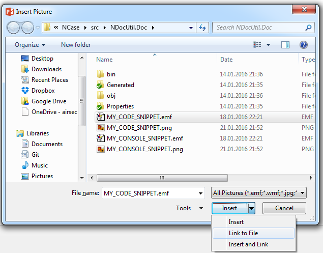

NDocUtil
========

NDocUtil injects and keeps up-to-date C# and console snippets in your documentation and presentations. 

You declare snippets in unit tests. After that, you can automatically:

- Update markdown documentation 
- Export the snippets as
	- Text file, 
	- Colored HTML fragment, 
	- Bitmap image (PNG, BMP),
	- Vector image (EMF).

Have you ever made a Powerpoint presentation containing code snippets? The maintenance of code snippets is a nightmare! With *NDocUtil*, the code snippets are refreshed automatically on every build!

*NDocUtil* was primarly developed to write the documentation for the [NCase] project. 

Let's see how it works...

Installation
------------

In the Nuget Package Manager Console:

```
Install-Package NDocUtil
```

Update markdown documentation
-------------------------------

Imagine, you write the following documentation in a file called [MyDocumentation.md][MyDocumentation_markdown]:

	MyDocumentation Example
	=======================
	
	Here is how you print out the ISO 8601 date:

	```C#
    var someDate = new DateTime(2011, 11, 11, 11, 11, 11);
	Console.WriteLine(someDate.ToString("o"));
	```
	
    Output:

	```
	2011-11-11T11:11:11.0000000Z
	```

Instead of writing the code blocks yourself in the documentation, NDocUtil can inject the lines of code from a real scenario. It ensures that you don't write mistakes, and that the documentation is refreshed during the build process, whatever the refactoring you perform.

You need to proceed as follows:

### 1) Add placeholders in the markdown file

First, you need to define placeholders in the markdown document, where the snippets have to be injected. A placeholder consists of a code block preceded by a html comment looking like `<!--# SNIPPET_NAME -->`, where `SNIPPET_NAME` is the name of the snippet to inject. 

The previous document looks like after the change:

	MyDocumentation Example
	=======================
	
	Here is how you get the ISO 8601 date:

	<!--# MY_CODE_SNIPPET -->
	```C#
    var someDate = new DateTime(2011, 11, 11, 11, 11, 11);
    Console.WriteLine(someDate.ToString("o"));
	```
	
    Output:

	<!--# MY_CONSOLE_SNIPPET -->
	```
    2011-11-11T11:11:11.0000000
	```

*Remarks*

- if you introduce a new code block for the first time, you need to add at least one character inside the code block, elsewhere the code snippet will not be injected:

		<!--# SNIPPET -->
		```
        at least one character here!
		```

- NDocUtil only supports injection into fenced code blocks with three back-ticks ```. It doesn't support the inline code blocks nor the indented code blocks. See  the [markdown documentation][codeblock].

### 2) Write snippets

Next, you need to write pseudo unit-tests containing the code and console snippets. The test fixture will also perform the update of the markdown documentation. 

The file must have the same name as the markdown file without its extension and must be located in the same folder as the documentation file. In the example, we name it then [MyDocumentation.cs][MyDocumentation_cs]. 

You need to add this file into a C# project. If the file is not in a subfolder of the project, you must add it as a link. See the [msdn documentation][addaslink].

In our example the file looks like: 

    [TestFixture]
    public class MyDocumentation
    {
        private readonly NDocUtil docu = new NDocUtil("docu");

        [TestFixtureTearDown]
        public void UpdateMarkdownFile()
        {
            docu.UpdateDocAssociatedToThisFile();
        }

        [Test]
        public void PairwiseGenerator()
        {
            docu.BeginRecordConsole("MY_CONSOLE_SNIPPET");

            //# MY_CODE_SNIPPET
            var someDate = new DateTime(2011, 11, 11, 11, 11, 11);
            Console.WriteLine(someDate.ToString("o"));
            //#

            docu.StopRecordConsole();
        }
    }

- Here we use NUnit, but you can use any other test framework
- The instance of `NDocUtil` is used to record the snippets and update the documentation
	- The argument `docu` in `new NDocUtil("docu")` is a (regex) tag that can be used to hide rows in code snippets
- The call to `docu.UpdateDocAssociatedToThisFile()` performs the documentation update. It is located in the fixture tear down method, ensuring that the console records have been recorded before.
- The code snippets are declared with the following syntax:

        //# NAME_OF_THE_SNIPPET
        ... code here
        //#
    - Nesting is not supported 
    - There is no escape character, so you can't write `//#` at the beginning of a line inside the snippet
    - Lines containing the exclusion tag are excluded from the snippet
- The console snippets are recorded with the following syntax:

        docu.BeginRecordConsole("NAME_OF_THE_SNIPPET");
        ... C# statements echoing to the console
        docu.StopRecordConsole();
	- Nesting is not supported
	- The exclusion tag doesn't apply to console snippets

That's it! Now every time that you execute the unit tests, then the markdown document is refreshed automatically.

Exporting snippets
------------------

NDocUtil also allows to export the snippets directly as file.

### Export as raw file

To export each snippet as raw text file `MY_SNIPPET_NAME.snippet`, use:

<!--# SaveSnippetsAsRaw -->
```C#
docu.SaveSnippetsAsRaw();
```

You can change output path and the file extension as follows:

<!--# SaveSnippetsAsRaw2 -->
```C#
docu.SaveSnippetsAsRaw(path:"anotherPath", fileExtension:".txt");
```

### Export as HTML snippet

To export each snippet as HTML fragment file: `MY_SNIPPET_NAME.html`, use:

<!--# SaveSnippetsAsHtml -->
```C#
docu.SaveSnippetsAsHtml();
```

You can decorate the HTML fragment, change the output path and file extension as follows:

<!--# SaveSnippetsAsHtml2 -->
```C#
docu.SaveSnippetsAsHtml(htmlSnippetDecorator: "{0}", path:"anotherPath", fileExtension:".htm");
```

- The string `htmlSnippetDecorator` must contain the format placeholder `{0}`. The snippet will be injected at this location. For example, you can generate an HTML *Page* with the following decorator: `"<html><body>{0}</body></html>"`

### Export as image

To export each snippet as an image file `MY_SNIPPET_NAME.img_format_extension`, use:

<!--# SaveSnippetsAsImage -->
```C#
docu.SaveSnippetsAsImage(ImageFormat.Png);
```

You can change the output path as follows:

<!--# SaveSnippetsAsImage2 -->
```C#
docu.SaveSnippetsAsImage(ImageFormat.Png, path:"anotherPath");
```

The supported format are `Bmp`, `Png`, `Emf`. The latter exports the snippet into a vector graphics, allowing to display properly the snippet on any device at any scale!


Maintaining snippets in Powerpoint presentation
-----------------------------------------------

While you insert an image into a powerpoint presentation, you can choose to add it with the button "Link to File":



It is a good opportunity for us to enable the automatic refreshing of code snippets:

- Let NDocUtil exports the snippets as image, with the following call:
	<!--# SaveSnippetsAsImage3 -->
	```C#
    docu.SaveSnippetsAsImage(ImageFormat.Emf, path:"pathToPowerpointFile");
	```

- Then insert the EMF file with the option "Link to File" 
	- *Remark*: the image file must be located in the same folder as the powerpoint file in order to remain portable.

That's it: The snippets will be refreshed on every build inside your presentation!

The result can be seen in [this presentation](./Presentation.pptx).  


[MyDocumentation_markdown]: MyDocumentation.md 
[MyDocumentation_cs]: MyDocumentation.cs 
[NCase]: https://github.com/jeromerg/NCase
[addaslink]: https://msdn.microsoft.com/de-de/library/windows/apps/jj714082%28v=vs.105%29.aspx?f=255&MSPPError=-2147217396
[codeblock]: https://github.com/adam-p/markdown-here/wiki/Markdown-Cheatsheet#code-and-syntax-highlighting
